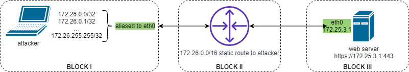
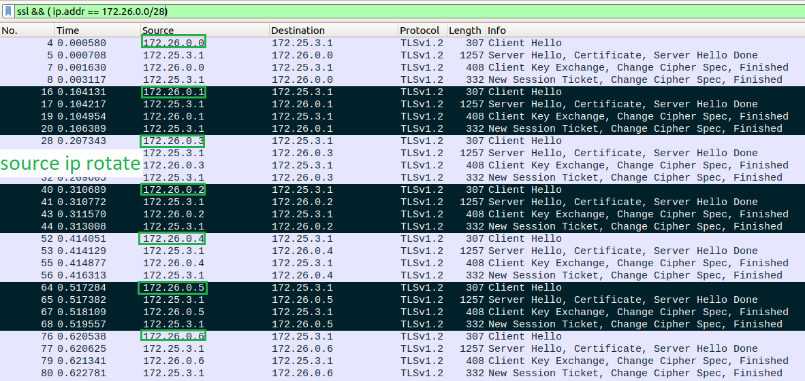

# Motivation
Web server TLS handshake benchmarking tool

# Why it forked
After some research I found [thc-tls-dos](https://github.com/azet/thc-tls-dos) - tool
that exploits the fact that server renegotiate encryption key when client ask to do so.
Actually, web server vendors, like nginx, [disabled](http://nginx.org/en/CHANGES-1.18) this feature in
version 0.8.23 back in 11 Nov 2009, so this attack vector
is not used anymore. Anyway, original project traffic flow looks like this:
1. Establish TCP connection
2. Open SSL session
3. ChangeCipherSpec <- at this point modern web server sends SSL alert and closes TCP connection

Traffic flow I wanted to:
1. Establish TCP connection
2. Open SSL session
3. Close TCP connection
4. Back to 1st step

# Test lab
To emulate botnet attack from many ips, attcker's _eth0_ aliased with ips from
 172.26.0.0/16 subnet (BLOCK I on pic. 1). Static route to 172.26.0.0/16 to attackers PC on router
  (BLOCK II on pic. 1). Router is in between attacker and web server (BLOCK III on pic. 1)


_Pic. 1 test lab scheme_

# Usage
1. Compile instruction [from original project](https://github.com/azet/thc-tls-dos/blob/master/README.TXT)
2. Execute:
    ```
    src/thc-ssl-dos -i eth0 172.25.3.1 443 2> /dev/null
    2351.12 SSLConn/sec
    2257.12 SSLConn/sec
    2432.12 SSLConn/sec
    ```
    Server site traffic dump shows that TCP connection (from all the _eth0_ aliased IP range) is established,
     then goes SSL handshake and TCP connection closes right after:
    
    
# PS
After this project has been finished I've found [tempesta tls-perf project](https://github.com/tempesta-tech/tls-perf).
According to README, it was inspired by the same thc-tls-dos, but it uses multithreading and written in C++.
Looks much better...
